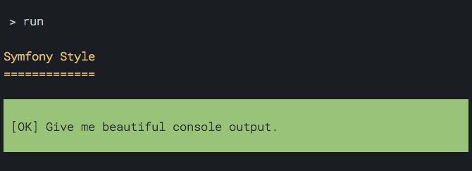
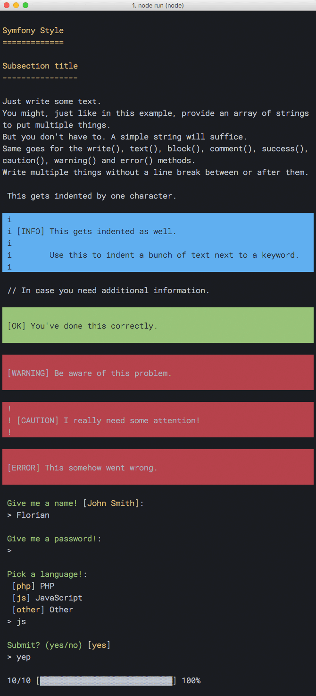

# symfony-style-console

Use the style and utilities of the [Symfony Console](https://symfony.com/doc/current/console/style.html) in Node.js.



## Important Note
Since *Symfony* is, for good reason, a registered trademark, please take note that I'm in no way associated with [the Symfony brand](https://symfony.com/) or the [SensioLabs](https://sensiolabs.com/) organization. Therefore I don't represent or speak for any of them.

## Reasoning
While developing a PHP project using the *Symfony* framework, I found myself in the need of writing some Composer `post-install-cmd` scripts in Node.js.

Sadly, they did not visually align to the output from PHP which was using the `Symfony\Component\Console\Style\SymfonyStyle` class. So I decided to port that class and its environment to [TypeScript](https://typescriptlang.org) to be able to use that style in Node.js.

Since style is always more or less closely coupled to different features, this package actually contains some nice utility the Symfony folks built into their console.

## Usage
First, of course, you need to install this package:
```bash
# With Yarn
yarn add symfony-style-console

# With npm
npm install --save symfony-style-console
```

Then, pull the `SymfonyStyle` class from the package and instantiate it:
```javascript
const { SymfonyStyle } = require('symfony-style-console')

// Or the more verbose way, in case you use Node.js v4:
const SymfonyStyle = require('symfony-style-console').SymfonyStyle

const io = new SymfonyStyle()
```

### `import`/`export`
Since ES modules are coming [to more and more engines](http://caniuse.com/#feat=es6-module), this package offers an alternative build using ES2015 modules.

You can use it like this (note that you'll currently still need a Babel-like build chain to resolve those modules):

```javascript
import { SymfonyStyle } from 'symfony-style-console/modern'

const io = new SymfonyStyle()
```

### Basics
The `io` instance now offers several different methods. If you know the Symfony console—Since this package aims to get as close to 100% API compatibility with the original PHP class as it can get—you may already be familiar with them.

**Protip:** Because this package is written in TypeScript, you can get type hints for the `io` instance if you use an editor with support für `*.d.ts` declaration files.

Back to topic, the available methods on the `io` instance are:
```javascript
// Put out a stylish title
io.title('Symfony Style')

// Similar to `title`, but less showy
io.section('Subsection title')

// The plain old `writeln` method. Does what you'd expect it to do.
io.writeln([
  'Just write some text.',
  'You might, just like in this example, provide an array of\n\
strings to put multiple things.',
  'But you don\'t have to. A simple string will suffice.',
  'Same goes for the write(), text(), block(), comment(),\n\
success(), caution(), warning() and error() methods.'
])

// Equivalent to `writeln`, but doesn't put a line break after
io.write([
  'Write multiple things without ',
  'a line break between or after them.'
])

// Put 2 blank lines on the screen.
// The argument is optional and defaults to 1
io.newLine(2)

// `text` blocks get indented by one character.
io.text('This gets indented by one character.')

// `comment` blocks are also indented and preceded
// by a double slash "//"
io.comment('In case you need additional information.')

// `block` serves to group content, with a certain styling.
io.block([
  'This gets indented as well.',
  'Use this to indent a bunch of text next to a keyword.'
], 'INFO', 'fg=black;bg=blue', ' i ', true)

// `success`, `warning`, `caution` and `error` are really
// just predefined `block` statements.
// Doesn't make them less useful though.
io.success('You\'ve done this correctly.')
io.warning('Be aware of this problem.')
io.caution('I really need some attention!')
io.error('This somehow went wrong.')


// Questions

// Please do gently ignore the fact that I haven't added
// an `async` wrapper function to the following methods.
// I just wanted to omit the visual noise. Also note that
// async/await is only available in Node.js 7.6 and above.

// Ask for strings
const name = await io.ask('Give me a name!', 'John Smith')

// Ask for strings without showing them
const passwd = await io.askHidden('Give me a password!')

// Ask for picking from a collection
const language = await io.choice('Pick a language!', {
  php: 'PHP',
  js: 'JavaScript',
  other: 'Other'
})

// Ask for confirmation
const submit = await io.confirm('Submit?')

// Last but not least: Progress bars!

// Create one!
io.progressStart(10)

// Advance it!
io.progressAdvance(6)

// Set it!
io.progressSet(3)

// Finish it!
io.progressFinish()
```

A screenshot of the result is below. Look at this beautiful terminal.




### Advanced
#### Verbosity
You can set the verbosity of the `io` instance to only print what you need:

```javascript
const {
  SymfonyStyle,
  VERBOSITY_NORMAL,
  VERBOSITY_VERBOSE,
  VERBOSITY_DEBUG
} = require('symfony-style-console')

// Default verbosity is VERBOSITY_NORMAL...
const io = new SymfonyStyle()

// ...so this won't be printed:
io.writeln('This is a more verbose message', VERBOSITY_VERBOSE)

// Set the verbosity real high
io.setVerbosity(VERBOSITY_DEBUG)

// Now the same message will suddenly appear:
io.writeln('This is a more verbose message', VERBOSITY_VERBOSE)
```

The available verbosity options are (in this order, from least to most verbose):

* `VERBOSITY_QUIET` (no output at all)
* `VERBOSITY_NORMAL` (default)
* `VERBOSITY_VERBOSE`
* `VERBOSITY_VERY_VERBOSE`
* `VERBOSITY_DEBUG`

##### Using verbosity programmatically

Note that the verbosity options are only available on the `write()` and `writeln()` methods.

However, those `VERBOSITY_*` constants are just numbers and you can compare them as you need:

```javascript
// Verbosity setting is at least VERBOSITY_VERBOSE
if (io.getVerbosity() > VERBOSITY_NORMAL) {
  io.success('You have a verbose console!')
}
```

Or to make that even more comfortable, use the builtin methods:
```javascript
// Checks if output is completely turned off
io.isQuiet()

// The following do always read as "is AT LEAST ****"
io.isVerbose()
io.isVeryVerbose()
io.isDebug()
```

##### Setting verbosity via command line flags
Symfony itself ties those verbosity levels to certain command line flags (`-q`, `-v`, `-vv` and `-vvv`).

This package does not aim to be a CLI framework though, so if you want to use those flags, you'd have to bind them to the verbosity manually.

The following code would mimic Symfony's behaviour:

```javascript
const {
  SymfonyStyle,
  VERBOSITY_QUIET,
  VERBOSITY_VERBOSE,
  VERBOSITY_VERY_VERBOSE,
  VERBOSITY_DEBUG
} = require('symfony-style-console')

const io = new SymfonyStyle()

const flagMap = {
  '-q': VERBOSITY_QUIET,
  '--quiet': VERBOSITY_QUIET,
  '-v': VERBOSITY_VERBOSE,
  '-vv': VERBOSITY_VERY_VERBOSE,
  '-vvv': VERBOSITY_DEBUG
}

const argv = process.argv.slice(2)
for (const flag in flagMap) {
  if (argv.indexOf(flag) !== -1) {
    io.setVerbosity(flagMap[flag])
    break
  }
}
```

#### Styling
You can style your console output in a markup-like fashion:

```javascript
io.writeln('This is <fg=blue>blue</> text!')
```

Styles can be a combination of foreground (`fg`) and background color (`bg`) as well as a comma-separated list of additional `options`.

Want a fully fledged example? Observe:

```javascript
io.writeln([
  'Give it a crazy style:'
  '<fg=green;bg=magenta;options=underscore,bold>Yeah!</>'
])
```

Note that you can nest stylings, but nested styling markup will not inherit parent styles.

The following code block does explain what that means:

```javascript
// Style the phrase: "This text is green with an underlined word."
io.write([
  // This part is green
  '<fg=green>This text is green with an ',

  // This part is underlined but not green
  '<options=underscore>underlined</>',

  // This part is green again
  ' word.</>'
])
```

##### Colors
The following colors are available: `black`, `red`, `green`, `yellow`, `blue`, `magenta`, `cyan`, `white` and `default`

##### Styles
Supported styles include (support for each may vary): `bold`, `underscore`, `blink`, `reverse`, `dim` and `conceal`

##### Blocks
Styles are escaped in `block()` output and in all output derived from `blocks` (`success`, `warning`, `caution` and `error`). This is a design decision by the Symfony team and I'm not going to interfere with that.

### API variations
There are some small things that differ from Symfony's original API.

#### Dropped method: `askQuestion`
Since the questions part is not actually a port of the original code but a completely custom implementation, there are no `Question` objects and thus no need or functionality for an `askQuestion` method on the `SymfonyStyle` class.

#### Privatized method: `createProgressBar`
As opposed to the original, this package's `SymfonyStyle` class has no public `createProgressBar` method.

That method is integrated more deeply into the Symfony ecosystem than this project aims to support, and it's not necessary for the *user facing* API.

It still exists though, could be called and provide the same functionality, but it has been marked as `private` in source code so it doesn't appear in the TypeScript Definition files.

#### Added method: `progressSet`
I was missing a method to set the value of a progress bar to a certain step instead of just advancing it.

That's why I added the `progressSet(step)` method. This is not present in the original `SymfonyStyle` class.

#### The `dim` style option
I personally find the `dim` style pretty appealing, so I added it to the style options.

However, be aware that support is not too widespread (does not work on Windows as far as I know).

#### Return type: Questions
The interactive `ask`, `askHidden`, `choice` and `confirm` methods on the original `SymfonyStyle` class do return their results directly.

Since JavaScript is asynchronous in its nature, Promises are returned that resolve to the resulting values.

Also, the original class allows numeric values for the `choice` question type. This is technically possible in this library but since JavaScript object literals only support strings as keys, numeric values will be returned as strings.
